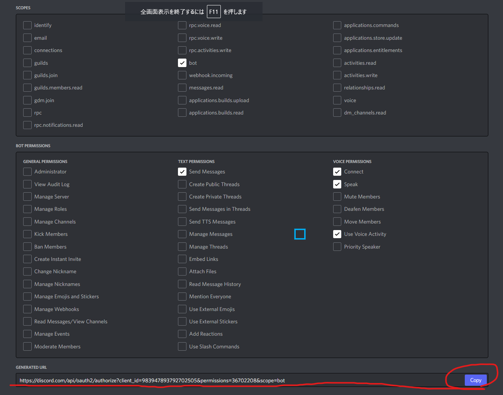
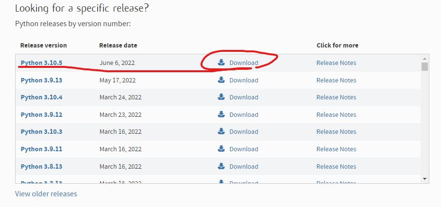
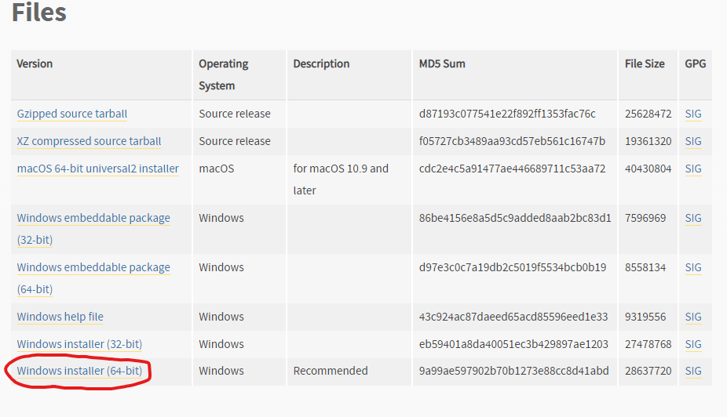
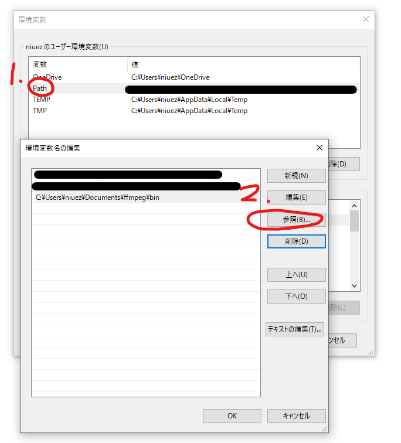
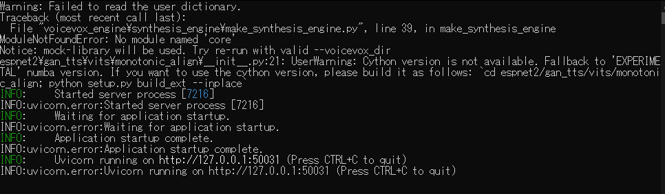

# なこちゃんの出迎え方

## coeiroinkのダウンロード

[COEIROINK-DOWNLOAD](https://coeiroink.com/download)からダウンロードします。ページに記載されているように、GPU版の場合はcudaのインストールも必要です。  
ダウンロードが終わったら解凍しておきます。

## テストする用のdiscordサーバーを建てる

discordの画面左の+ボタンからできます。

## discord botのセットアップ

[Discord Developer Portal](https://discord.com/developers/applications)からセットアップします。

1. New Applicationをクリックして、アプリの名前を入力、CREATEを押します。(ボットの名前ではないので適当でいいです。)
2. 左のメニューからBotを選択、Add Botを押します。
3. Botを作ると、Privileged Gateway Intentsという項目があります。このチェックを全部入れてください。最後にSave Changesをクリックして保存します。

4. Botのアイコンの横にある、Reset TokenをクリックしてTokenを生成します。コピーしてどこかにメモしておいてください。流出するとボットを制御されてしまうので注意。
5. 左のメニューからOAuth2のURL Generatorを選択し、Botに与える権限を選びます。
    - SCOPESのbot
    - TEXT PERMISSIONSのSend Messages
    - VOICE PERMISSIONSのConnect, Speak, Use Voice Activity

6. 下のGENERATED URLをコピーして、ブラウザの別タブで開きます。追加するサーバーを選択して認証をします。
7. 選択したサーバーにBotが参加したらセットアップ完了です。

## Python3のインストール

### Windows

> WSL, WSL2からだと、Windowsに建てたcoeiroinkのサーバーにアクセスするのが難しいかもしれません。niuezは方法がわからなかったので、Windowsに直接環境を構築しました。できた人は教えてくれると助かります。

[Download Python | Python.org](https://www.python.org/downloads/)から最新のバージョンを選択し、Windows installerをダウンロードしてインストールします。





### MacOS

[Homebrew](https://brew.sh/)を使ってインストールするのが簡単です。

```
brew install python3
```

## discord.pyのインストール

[Rapptz/discord.py](https://github.com/Rapptz/discord.py)のREADMEを参照します。

Windowsであれば
```
py -3 -m pip install -U discord.py[voice]
```

MacOSであれば
```
python3 -m pip install -U "discord.py[voice]"
```

M1Macの場合、[OpusError on macOS arm64 platform (only) #8046](https://github.com/Rapptz/discord.py/issues/8046)というIssueがあり、2022/06/08時点でgithubのmainから最新の状態を持ってくることでしか動作させられません。なので、以下を使ってインストールしてください。
```
git clone https://github.com/Rapptz/discord.py
cd discord.py
python3 -m pip install -U .[voice]
```

## alkanaのインストール

英語の辞書です

```
pip install alkana
```


## ffmpegのダウンロード

音声を再生するためにffmpegが必要です。

### Windowsの場合

1. から、最新バージョンのessentials_buildをダウンロードして解凍してください。
2. binフォルダにffmpeg.exeが入っています。このフォルダにPATHを通してください。

#### Python3スクリプトをpowershellで動かす場合のffmpegのパスの通し方

1. windowsの検索機能で「path」と入力し、環境変数の設定を選択します。

2. ユーザー環境変数の「Path」をダブルクリック、参照を選択して、ffmpegのbinフォルダを選択してPathに追加します。

3. powershellを起動し`ffmpeg`が実行できるか確認してください。

### MacOSの場合

```
brew install ffmpeg
```

## 実行方法

1. このリポジトリをクローンしておきます。
2. coeiroinkのフォルダに`run.exe`があるのでこれを実行します。

3. Python3スクリプトを実行します
    - win: `py -3 ext_discord.py`
    - mac: `python3 ext_discord.py`
4. サーバーのボイスチャットに接続して、適当なテキストチャットに`>con`と入力して接続します。
